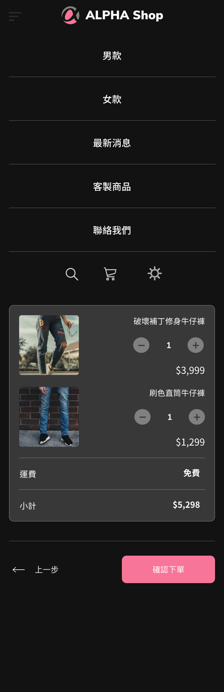

# ALPHA Shop 購物車 Vue 版本

分為「寄送地址、運送方式、付款資訊」三個操作階段的單頁式應用(Single-page application)結帳頁面
<br>於「付款資訊」階段，點擊「確認」按鈕即可開啟互動視窗(Modal)顯示使用者輸入資料

- 資料處理

  - 即時計算運費、購物總金額
  - 使用 localStorage 即時儲存使用者輸入資料

- 版面佈局
  - 支援深色模式
  - 元件採用漸變動畫

<br>




<br>

## 1.安裝專案資料

1. 將原始碼安裝至指定位置，你可以採取下列其中一種方法

   1. 點選右上方綠色『Code』按鈕，選擇『Download ZIP』下載 ZIP 檔，並解壓縮至專案資料夾中。
   2. 開啟『終端機 Terminal.app』，或在Ｗ indows 開啟『命令提示字元 cmd』

      輸入指令，移動到該專案資料夾位置

      ```text
      cd 「專案資料夾路徑」 (資料夾名稱間的空格要用「 / 」隔開)
      ```

      輸入指令將專案 clone 至專案資料夾

      ```text
      git clone https://github.com/Pudding1989/Alpha-Shop-Vue.git
      ```

## 2.啟動伺服器

### 開啟『終端機 Terminal.app』，或在 Windows 開啟『命令提示字元 cmd』執行以下指令

1. 安裝本專案使用的套件

```text
npm install
```

2. 輸入執行指令，啟動伺服器

輸入執行指令，開啟伺服器

```text
npm run serve
```

3. 於瀏覽器開啟網站

```t3xt
App running at:

  - Local:   http://localhost:8080/

  - Network: http://192.168.0.1:8080/
```

4. 記得在終端機按下 `⌃ (Ctrl) + c` 或是在命令提示字元 `ctrl + c` ，關閉伺服器

## 開發工具版本

前端框架

- Vue: 2.6.11
  - Vue Router: 3.2.0

Sass 套件

- Node Sass: 4.12.0
- Sass Loader: 8.0.2
